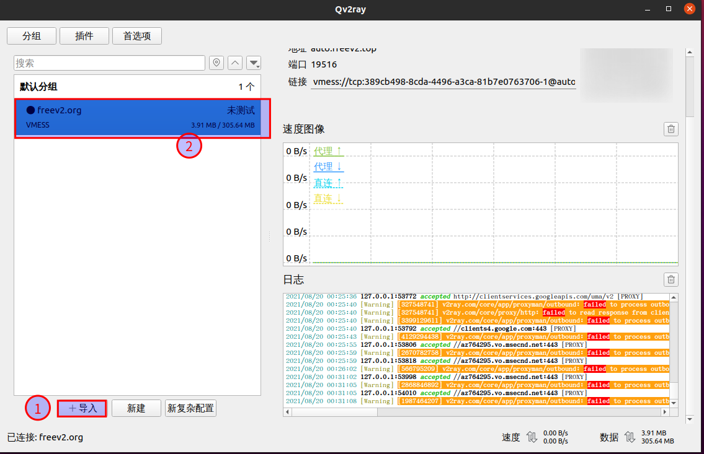

<!--
 * @Author: your name
 * @Date: 2021-08-20 00:23:15
 * @LastEditTime: 2021-08-20 00:52:23
 * @LastEditors: Please set LastEditors
 * @Description: In User Settings Edit
 * @FilePath: /sphinx-note/source/和谐教程.md
-->
# Github加速
当前使用github时经常遇到网站无法访问，下载release版本较慢的问题，解决该问题有两种途径：使用github镜像和使用代理。

## 使用github镜像

推荐使用的github镜像有:[fastgit](https://hub.fastgit.org/)

## 使用代理
推荐使用v2ray配置代理，国内相对比较稳定。
1. 下载代理管理软件
QV2ray提供了V2Ray的管理页面，虽然该项目当前已经不在维护，但是当前的开发进度足以满足大众需求，其下载地址为：[QV2Ray](https://hub.fastgit.org/Qv2ray/Qv2ray/releases)
2. V2ray账号可从[FreeV2ray](https://view.freev2ray.org/)获取，获取到账号以后，导入到QV2ray即可:

   