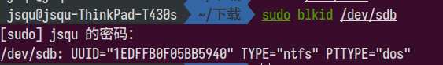
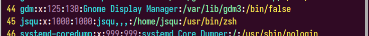

# Ubuntu配置

## 挂在第二块硬盘

使用GParted对硬盘进行分区以后第二块硬盘就会在文件管理器中显示出来。Gparted可以通过以下指令安装。

```shell
sudo apt install gparted
```

## 开机启动慢

1. 查看系统启动慢的原因，通过指令`systemd-analyze blame`，分析启动耗时。

2. 编辑grub选项`sudo  vi /etc/defaults/grub`，在开机时打印开机日志，找到grub中的`GRUB_CMDLINE_LINUX_DEFAULT="quiet splash"`，将其改为`GRUB_CMDLINE_LINUX_DEFAULT=""`
3. 更新grub:`update-grub2`
4. 重启电脑，可以看到当前系统需要找到第二块硬盘，但是当前的UUID是错误的。需要将第二块硬盘的UUID修正以下。
5. 通过`sudo blkid /dev/sdb`,即可获取到当前的UUID，修正以后，恢复grub设置，重新启动。
   

## 安装zsh

对于Linux开发者来说，最常用的工具就是shell，其负责与Linux内核进行交互提供了常用的查找、拷贝、重命名等常用的功能，Ubuntu下支持的shell工具可以通过`cat /etc/shells`查看：

```shell
/bin/sh
/bin/bash
/usr/bin/bash
/bin/rbash
/usr/bin/rbash
/bin/dash
/usr/bin/dash
/bin/zsh
/usr/bin/zsh
```

zsh是一种专为交互使用而设计的shell，对Bourne shell做出了大量改进，同时加入了Bash、ksh及tcsh的某些功能。自2019年起，macOS的默认Shell已从Bash改为Zsh。其介绍参见[维基百科](https://zh.wikipedia.org/wiki/Z_shell),下面介绍其安装与配置。

### zsh安装

1. 安装zsh:`sudo apt install zsh`
2. 将zsh设置为用户的默认shell:`chsh -s /usr/bin/zsh`
3. 如果执行上述命令报错:`chsh: PAM: Authentication failure`,需要使用root权限更改是系统配置：`sudo vim /etc/passwd`
   
4. 注销后重新打开shell，即可发现当前用户的默认shell已经修改为zsh

### 配置oh-my-zsh

参见[官网](https://ohmyz.sh/)

1. 安装oh-my-zsh需要使用git、curl或者wget: `sudo apt install curl`或者`sudo apt install wget`。
2. 安装oh-my-zsh：

   ```shell
   # via curl
   sh -c "$(curl -fsSL https://raw.github.com/ohmyzsh/ohmyzsh/master/tools/install.sh)"
   # via wget
   sh -c "$(wget https://raw.github.com/ohmyzsh/ohmyzsh/master/tools/install.sh -O -)"
   ```

3. 安装插件zsh-autosuggestions

   ```shell
   git clone https://github.com/zsh-users/zsh-autosuggestions ${ZSH_CUSTOM:-~/.oh-my-zsh/custom}/plugins/zsh-autosuggestions
   ```

4. 安装插件zsh-autosuggestions

   ```shell
   git clone https://github.com/zsh-users/zsh-syntax-highlighting.git ${ZSH_CUSTOM:-~/.oh-my-zsh/custom}/plugins/zsh-syntax-highlighting
   ```

5. 安装git-open

   ```shell
   git clone https://github.com/paulirish/git-open.git $ZSH_CUSTOM/plugins/git-open
   ```

6. 启用插件，编辑`.zshrc`:`vim ~/.zshrc`，找到`plugins`:

   ```shell
   plugins=(git zsh-autosuggestions zsh-syntax-highlighting git-open)
   ```

7. 更改主题为`agnoster`,编辑`.zshrc`:`vim ~/.zshrc`，找到`ZSH_THEME`:

   ```shell
   ZSH_THEME="agnoster"
   ```

8. 刷新配置，使上述配置生效：`source ~/.zshrc`

## 其他常用软件安装

### LLVM安装

[二进制安装](https://github.com/llvm/llvm-project/releases)

### GCC源码编译安装

1. GCC源码下载：[GitHub](https://github.com/gcc-mirror/gcc)

   ```shell
   git clone https://github.com/gcc-mirror/gcc.git
   # 查看当前的tag
   git tag -l
   # 检出当前要编译的版本分支
   git checkout releases/gcc-11.2.0
   ```

2. 必要工具安装

   ```shell
   sudo apt install flex
   cd gcc
   contrib/download_prerequisites
   ```

3. 配置编译选项

   ```shell
   mkdir build
   cd build
   ../configure -v --build=x86_64-linux-gnu --host=x86_64-linux-gnu --target=x86_64-linux-gnu --prefix=/usr/local/gcc-11.2.0 --enable-checking=release --disable-multilib
   ```

4. 编译安装

   ```shell
   make -j4
   # 需要在/usr/local中创建gcc-11.2.0目录，因此需要使用root权限。
   sudo make install
   ```

5. 设置环境变量

   ```shell
   export PATH=/usr/local/gcc-11.2.0/bin:$PATH
   export LD_LIBRARY_PATH=/usr/local/gcc-11.2.0/lib64:$LD_LIBRARY_PATH
   # 便于CMAKE获取到安装的GCC版本
   export CC=/usr/local/gcc-11.2.0/bin/gcc
   export CXX=/usr/local/gcc-11.2.0/bin/g++
   export FC=/usr/local/gcc-11.2.0/bin/gfortran
   ```

### CMake编译安装

1. 下载CMake源码：[下载地址](https://cmake.org/download/)
2. 安装依赖库opensll,egl,vulkan:`sudo apt install libssl-dev libegl-dev libvulkan-dev`。
3. 使用bootstrap工具完成配置:`./bootstrap --qt-gui --qt-qmake=where/is/qmake6`。
4. 执行make。
5. 使用root权限进行安装。

### VSCode配置

在Ubuntu的snap商店安装的版本可能会存在无法输入中文的问题，建议从官网下载deb包进行安装。

#### VScode插件安装

推荐使用的插件有：clangd，CodeLLDB，python，Markdown All In One,Latex WorkShop，GitLens,C++ TestMate,Cmake,CMake Tools，restructuredText等

#### 代码片段配置

VSCode提供了自定义配置代码片段的功能，基本的配置如下：

1. C语言代码片段

   ```json
   "Create c header file": {
         "prefix": "CREATE_C_HEADER",
         "body": [
            "#ifndef _${TM_FILENAME_BASE/(.*)/${1:/upcase}/}_H",
            "#define _${TM_FILENAME_BASE/(.*)/${1:/upcase}/}_H",
            "#ifdef __cplusplus",
            "extern \"C\" {",
            "#endif",
            "$0",
            "#ifdef __cplusplus",
            "}",
            "#endif",
            "#endif // _${TM_FILENAME_BASE/(.*)/${1:/upcase}/}_H_",
         ],
         "description": "Create c header file"
      },
      "Create c source file": {
         "prefix": "CREATE_C_SOURCE",
         "body": [
            "#include \"${TM_FILENAME_BASE}.h\"",
            "$0"
         ],
         "description": "Create c source file"
      }
   ```

2. CPP语言代码片段

   ```json
       "Create googletest cpp header": {
        "prefix": "CREATE_GOOGLETEST_CPP_HEADER",
        "body": [
            "#include \"gtest/gtest.h\"",
            "class ${TM_FILENAME_BASE/(.*)/${1:/upcase}/}: public ::testing::Test {",
            "protected:",
            "   static void SetUpTestSuite()",
            "    {",
            "        std::cout << \"[**********] TestLeetcode Suite Set Up\" << std::endl;",
            "    }",
            "    static void TearDownTestSuite()",
            "    {",
            "        std::cout << \"[**********] TestLeetcode Suite Tear Down\" << std::endl;",
            "    }",
            "    virtual void SetUp()",
            "    {",
            "        // std::cout << \"TestLeetcode Case Set Up\" << std::endl;",
            "    }",
            "    virtual void TearDown()",
            "    {",
            "        // std::cout << \"TestLeetcode Case Tear Down\" << std::endl;",
            "    }",
            "",
            "private:",
            "};"
        ],
        "description": "Create googletest cpp header"
    },
    "Create googletest cpp source": {
        "prefix": "CREATE_GOOGLETEST_CPP_SOURCE",
        "body": [
            "#include \"${TM_FILENAME_BASE}.hpp\"",
            "#include \"${TM_FILENAME_BASE/test_(.*)/${1}/}.h\"",
            "TEST_F(${TM_FILENAME_BASE/(.*)/${1:/upcase}/},case_01)",
            "{",
            "$0",
            "}",
            "TEST_F(${TM_FILENAME_BASE/(.*)/${1:/upcase}/},case_02)",
            "{",
            "$1",
            "}"
        ],
        "description": "Create googletest cpp source"
    }
   ```
