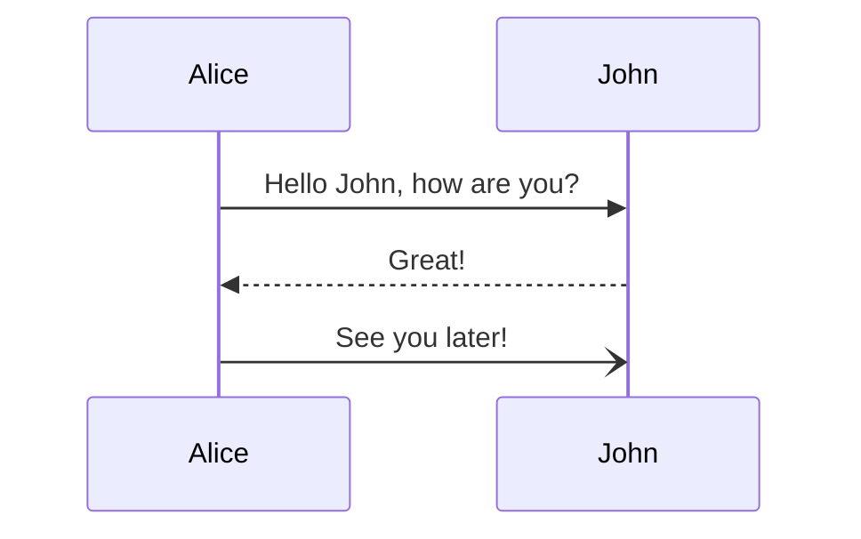

# mermaid使用

mermaid为用户使用文本和代码创建可视化图表提供了遍历，支持使用过markdown语法进行创建。详情参见[官方帮助文档](https://mermaid-js.github.io/mermaid/#/)

## 图表类型

### 流程图

流程图由节点(几何形状和边缘)、连接线(箭头或线条)组成。mermaid定义了这些节点和边的生成和交互方式。

```md
graph TD %% graph标识类型是流程图。TD标识流程图的空间布局
    A-->B; %% A/B/C/D标识节点 -->标识当前是带箭头的实线链接两个节点
    A-->C;
    B-->D;
    C-->D;
```

```{mermaid}
    graph TD
        A-->B;
        A-->C;
        B-->D;
        C-->D;
```

#### 节点

节点分为不带文本的节点和带文本的节点，对于带文本的节点需要指定节点的形状。

- 不带文本的节点。

    ```{mermaid}
        graph TD;
            id
    ```

- 带文本的节点。

    ```{mermaid}
        graph TD;
            id((id描述)) %% (())节点用圆形标识
    ```

#### 图的空间布局

空间布局主要是指流程图的延伸方向，如下：

| 标识  |     说明     |
| :---: | :----------: |
| TB/TD | 从上到下布局 |
|  BT   | 从下到上布局 |
|  LR   | 从左到右布局 |
|  RL   | 从右到左布局 |

1. 从上到下：`graph TD`

   ```{mermaid}
    graph TD
        start_id((Start)) ==> end_id((End))
    ```

2. 从下到上:`graph BT`

    ```{mermaid}
    graph BT
        start_id((Start)) ==> end_id((End))
    ```

3. 从左到右:`graph LR`

    ```{mermaid}
    graph LR
        start_id((Start)) ==> end_id((End))
    ```

4. 从右到左:`graph RL`

    ```{mermaid}
    graph RL
        start_id((Start)) ==> end_id((End))
    ```

#### 节点的形状

|    标识    |     说明     |
| :--------: | :----------: |
|  `[描述]`  |     矩形     |
|  `(描述)`  |   圆角矩形   |
| `([描述])` |  体育场形状  |
| `((描述))` |     圆形     |
| `[(描述)]` |   圆柱矩形   |
| `[[描述]]` |   双边矩形   |
|  `>描述]`  |  不对称形状  |
|  `{描述}`  |     菱形     |
| `{{描述}}` |    六边形    |
| `[/描述/]` |  平行四边形  |
| `[\描述\]` | 反平行四边形 |
| `[/描述\]` |     梯形     |
| `[\描述/]` |   倒置梯形   |

- 矩形节点

    ```{mermaid}
    graph RL
        Node[节点]
    ```

- 圆角矩形节点

    ```{mermaid}
    graph RL
        Node(节点)
    ```

- 体育场节点

    ```{mermaid}
    graph RL
        Node([节点])
    ```

- 不对称节点

    ```{mermaid}
    graph RL
        Node>节点]
    ```

#### 节点的链接

|                   标识                    |        说明        |
| :---------------------------------------: | :----------------: |
|                `--text--`                 |   不带箭头的实线   |
|                `-.text.-`                 |   不带箭头的虚线   |
|                `==text==`                 | 不带箭头的加粗实线 |
|                `--text-->`                |   不带箭头的实线   |
|                `-.text.->`                |   不带箭头的虚线   |
| `==text==>` 或者`A-->|This is the text|B` | 不带箭头的加粗实线 |

#### 级联和多个节点链接到同意节点

- 级联

    ```{mermaid}
    graph LR
        A>节点] --text A--> B([Node B]) -->|text B|C(Node C)
    ```

- 多个节点链接到同一个节点

    ```{mermaid}
    graph LR
        A>节点] --text A--> B([Node B]) & C((Node C))-->|text BC|D(Node D)
    ```

### 序列图

```{mermaid}
sequenceDiagram
    participant Alice
    participant Bob
    Alice->>John: Hello John, how are you?
    loop Healthcheck
        John->>John: Fight against hypochondria
    end
    Note right of John: Rational thoughts <br/>prevail!
    John-->>Alice: Great!
    John->>Bob: How about you?
    Bob-->>John: Jolly good!
```



### 类图

```{mermaid}
classDiagram
    Class01 <|-- AveryLongClass : Cool
    Class03 *-- Class04
    Class05 o-- Class06
    Class07 .. Class08
    Class09 --> C2 : Where am i?
    Class09 --* C3
    Class09 --|> Class07
    Class07 : equals()
    Class07 : Object[] elementData
    Class01 : size()
    Class01 : int chimp
    Class01 : int gorilla
    Class08 <--> C2: Cool label
```

### 甘特图

```{mermaid}
gantt
dateFormat  YYYY-MM-DD
title Adding GANTT diagram to mermaid
excludes weekdays 2014-01-10

section A section
Completed task            :done,    des1, 2014-01-06,2014-01-08
Active task               :active,  des2, 2014-01-09, 3d
Future task               :         des3, after des2, 5d
Future task2               :         des4, after des3, 5d
```
### Git图

```{mermaid}
gitGraph:
options
{
    "nodeSpacing": 150,
    "nodeRadius": 10
}
end
commit
branch newbranch
checkout newbranch
commit

checkout master
commit
merge newbranch
```

### 实体关系图

```{mermaid}
erDiagram
    CUSTOMER ||--o{ ORDER : places
    ORDER ||--|{ LINE-ITEM : contains
    CUSTOMER }|..|{ DELIVERY-ADDRESS : uses
```

### 用户体验图

```{mermaid}
journey
    title My working day
    section Go to work
      Make tea: 5: Me
      Go upstairs: 3: Me
      Do work: 1: Me, Cat
    section Go home
      Go downstairs: 5: Me
      Sit down: 5: Me
```
